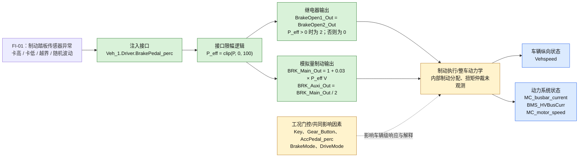

# FI-01 制动踏板异常：故障传播图（第 1 版）

> 本文件基于第 3 轮约 200 ms 数据保留，用于追溯。第 4 轮已补充扭矩、制动状态与 20 ms 采样数据；请以 [FI-01_故障传播图_第4轮.md](FI-01_故障传播图_第4轮.md) 为当前版本。

## 结论

FI-01 的故障传播已在**整车模型接口层**得到清晰验证：`Veh_1.Driver.BrakePedal_perc` 先经过下限钳位和上限饱和，再映射为两路制动继电器与主/辅制动电压输出；当车辆处于 `Key=1`、`Gear_Button=1`、`AccPedal_perc=100%` 的行驶工况时，正制动输入随后伴随车速下降以及 MC/BMS 母线电流降至接近零量级。

本图刻画的是“故障输入—模型接口—可观测车辆响应”链路。没有记录 VCU 内部制动仲裁状态、扭矩请求和实际制动扭矩，故不把内部控制算法画为已验证的确定路径。

## 传播图

图例：绿色为接口映射的实测验证；蓝色为已记录到的车辆级响应；黄色虚线/节点为基于整车运行逻辑的合理解释，仍需补充信号确认。

## 各段链路的证据与含义

| 链路 | 状态 | 数据证据 | 故障含义 |
| --- | --- | --- | --- |
| `BrakePedal_perc → clip(P,0,100)` | 已验证 | `-50%` 输出与 `0%` 基线一致；`150%` 输出与 `100%` 一致。 | 负向漂移会被屏蔽；超过 100% 的卡高/越界在下游执行接口不可区分。 |
| `P_eff → BrakeOpen1/2_Out` | 已验证 | 376 个样本中，两继电器零失配；`P_eff>0` 时均为 `2`，否则为 `0`。 | 两路继电器没有发现单通道异常或无依据翻转。 |
| `P_eff → BRK_Main/Auxi_Out` | 已验证 | 全样本满足主通道 `1+0.03×P_eff` V、辅助通道为主通道一半；最大残差分别为 `4.44e-16` V 和 `2.22e-16` V。 | 制动踏板的幅值故障会被等比例传至模拟量输出，直到触及上下限。 |
| 制动输出 → 车辆减速 | 已观测，机制待确认 | `Key=1`、`Gear=1`、`AccPedal=100%` 时，50%、100%、150% 和随机正向制动段均出现车速下降。 | 正向制动输入在本次工况中导致明显的车辆级减速；不能据此单独证明内部机械/再生制动分配。 |
| 制动输出 → 母线电流下降 | 已观测，机制待确认 | 上述正向制动段内，MC/BMS 母线电流由约 `510–1231` 降至约 `1–3`。 | 可作为动力响应观测量；因单位、正负方向及扭矩信号未记录，不能定量归因到某一制动通道。 |

## 典型故障传播场景

| 注入场景 | 接口层传播 | 实测车辆级现象 | 风险/测试判读 |
| --- | --- | --- | --- |
| 负向越界：`-50%` | 钳位为 `0%`；继电器 `0/0`；主/辅电压 `1/0.5 V`。 | 在满加速背景下，车速 `139.923 → 158.004`。 | 证明非法负值不会误触发制动；但其效果等同于“制动踏板失效为零”，在加速工况下存在未制动风险。 |
| 中幅制动：`50%` | 继电器 `2/2`；主/辅电压 `2.5/1.25 V`。 | 车速 `177.234 → 137.747`；MC/BMS 电流接近零量级。 | 正常映射基准，可用于比较卡高或漂移故障的偏差。 |
| 满量程：`100%` | 继电器 `2/2`；主/辅电压 `4/2 V`。 | 车速 `158.939 → 119.161`。 | 已达到模型接口的制动输出上限。 |
| 正向越界/卡高：`150%` | 饱和为 `100%` 对应的 `4/2 V`；继电器 `2/2`。 | 车速 `143.743 → 106.163`。 | 下游输出无法区分 100% 与 150%，故必须记录原始踏板输入或诊断标志，才能识别超量程故障。 |
| 随机正向踏板：`19.306%–90.672%` | 电压逐点线性跟随；继电器持续激活。 | 车速 `175.178 → 136.388`。 | 观测到的模拟量波动是注入波形的传播，不是无来源的输出抖动。 |

## 当前可确认与不可确认的边界

可确认：

- 制动踏板输入到两路继电器、主制动电压及辅助制动电压的精确映射和限幅行为。
- 正制动输入下，车辆速度与已记录的动力系统电流出现显著变化。
- `Key`、`Gear_Button`、`AccPedal_perc` 是解释车辆级响应必需的共同工况输入；本轮 `BrakeMode`、`DriveMode` 均保持 `0`，没有提供模式切换对传播链的证据。

尚不可确认：

- VCU 是否实现“制动优先”、如何处理加速和制动同时为正，以及仲裁发生在哪个模块。
- 减速中机械制动、再生制动和电机扭矩的各自贡献。
- 从踏板边沿到继电器、电压和车辆状态变化的真实响应延迟；现有采样周期约为 200 ms，只能证明未出现额外的采样点级滞后。

## 下一版图需要补充的观测接口

优先补录以下信号后，可将黄色“内部制动执行/整车动力学”节点拆分成可验证的子链路：

1. `Veh_1.FromVCU.CAN.VCU_Body.GW_VCU_2.VCU_TqReqCmd`：VCU 扭矩请求。
2. 前/后电机实际扭矩：`FMotor.Motor.MotTrq`、`FMotor.Motor.MotTrqManagement.FTrq`、`RMotor.Motor.MotTrqManagement.RTrq`。
3. 制动状态机、制动优先仲裁标志、机械/再生制动分配量及故障诊断位（若模型对外暴露）。
4. 10–20 ms 量级的采样记录，以计算接口输出和车辆响应的时延。

## 数据来源

- `FI-01_制动踏板故障分析报告_第3轮_工况补充.md`
- `FI-01_工况与事件统计_第3轮.csv`
- `FI-01_输入输出映射验证_第3轮.csv`
- `Veh_1_Output_Input_Dependency.csv` 中 `BrakePedal_perc → Vehspeed` 的静态生成代码数据流记录。
