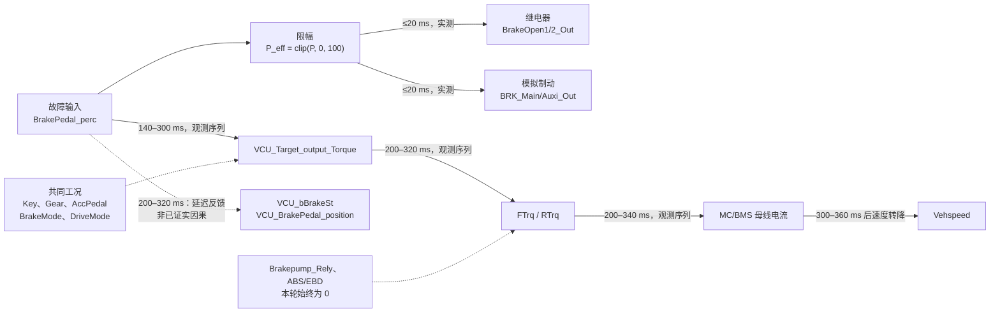

# FI-01 制动踏板异常：故障传播图（第 4 轮，20 ms）

## 结论

本轮记录 26 个信号、4103 个样本，采样周期约 20 ms。FI-01 传播可明确分为直接接口映射、已观测的动力响应序列、以及仅能作为反馈的 VCU 状态三部分。

关键边界：`VCU_bBrakeSt` 在正向制动后 200–320 ms 才置位；100% 和 150% 工况中，扭矩已在该状态反馈之前或同时快速撤除。因此，它是状态一致性信号，不应在传播图中画成“制动状态 → 扭矩撤除”的确定因果边。

## 正向制动的观测时序

以注入前 1 s 平均值为参考，表中“降至 5%”是首次小于等于该基线 5% 的记录时刻。它是采样可分辨的上界，而非精确执行延迟。

| 踏板注入 | 直接执行接口 | 目标扭矩降至 5% | 前/后扭矩降至 5% | MC / BMS 电流降至 5% | 车速达峰后转降 | VCU 制动状态 |
| --- | --- | ---: | ---: | ---: | ---: | ---: |
| 50% | 2/2；2.5/1.25 V；≤20 ms | 300 ms | 320 ms | 320 / 340 ms | 360 ms | 320 ms |
| 100% | 2/2；4/2 V；≤20 ms | 160 ms | 240 ms | 240 / 280 ms | 300 ms | 240 ms |
| 150% | 2/2；4/2 V；≤20 ms | 140 ms | 200 ms | 200 / 240 ms | 340 ms | 200 ms |

50%、100% 和 150% 都会触发相同类别的扭矩撤除和减速响应；但 `150%` 的主/辅电压与 `100%` 完全相同。因此，超量程只能由原始踏板输入或专用诊断位识别。

## 负向越界的反向证据

`BrakePedal_perc=-50%` 时：两继电器保持 `0/0`，主/辅电压保持 `1/0.5 V`，VCU 制动状态、ABS/EBD 和制动泵状态均保持 `0`。目标/实际扭矩与 MC/BMS 电流均没有出现正向制动案例中的快速归零；在 5.08 s 内，车速由 `85.16` 增至 `149.71`。

这确认负值被钳位为零制动，同时形成“制动需求被屏蔽、车辆继续加速”的故障风险链。

## 可确认与不可确认

- 可确认：踏板到继电器和主辅制动电压的映射；正向制动后的扭矩、电流、车速响应时间序列。
- 不可确认：机械制动与再生制动的分配比例；VCU 状态位是否为扭矩撤除的唯一控制原因；ABS/EBD 在未触发工况下的处理逻辑。
