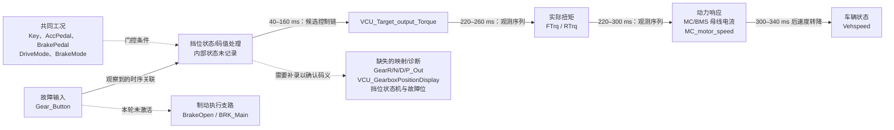

# FI-04 挡位切换异常：故障传播图（20 ms）

## 结论

本轮记录 26 个信号、5246 个样本，采样周期约 20 ms。在 `Key=1`、`AccPedal=100%`、`BrakePedal=0%` 的干净切换段中，挡位码 `0`、`2`、`3` 都伴随目标扭矩、前后实际扭矩及母线电流快速撤除，随后车速转为下降；切回码 `1` 后动力恢复。码 `5` 与 `-1` 则未观察到同类扭矩切断，车辆仍保持正向加速。

该结论描述的是**码值行为**，不假定各数值对应 P/R/N/D 或非法码；当前记录没有枚举表和挡位状态机输出。若 `5`、`-1` 在项目定义中属于非法码，则其未进入已观察到的扭矩抑制状态是高优先级风险迹象。

`Gear_Button → 挡位状态/码值处理 → 目标扭矩` 是根据干净切换段的时间顺序提出的候选因果链。`VCU_Target_output_Torque` 同样是外部记录接口，未能排除试验脚本或外部 VCU 在同一时刻改写它的可能；要证明单一因果，需要固定该值或记录挡位状态机输出。

## 码值切换的时间证据

下表以切换前 1 s 平均值为基线；“降至 5%”表示首次低于等于基线 5% 的记录时刻。结果来自工况固定的 60.84 s 之后主测试段。

| 切入码值 | 目标扭矩降至 5% | F/R 扭矩降至 5% | MC / BMS 电流降至 5% | 车速峰值后转降 | 制动继电器/电压 | 观测结论 |
| --- | ---: | ---: | ---: | ---: | --- | --- |
| `0` | 120 ms | 260 ms | 260 / 300 ms | 340 ms | 保持基线 | 动力扭矩抑制，表现为滑行减速。 |
| `2` | 160 ms | 240 ms | 240 / 280 ms | 320 ms | 保持基线 | 动力扭矩抑制，表现为滑行减速。 |
| `3` | 40 ms | 220 ms | 220 / 260 ms | 300 ms | 保持基线 | 动力扭矩抑制，表现为滑行减速。 |
| `1`（恢复） | 目标扭矩恢复至 100：60–140 ms | F/R 扭矩恢复至 100：100–340 ms | MC 电流恢复至 100：100–340 ms | 随后重新加速 | 保持基线 | 动力恢复，未见持续锁存。 |

码 `0/2/3` 的短脉冲（约 0.32 s）也引起扭矩和电流显著下降，但由于持续时间不足，实际扭矩通常尚未来得及完全归零便已切回码 `1`；未发现短脉冲后的永久动力锁存。

## 码 5 与 -1 的风险证据

| 码值 | 持续时间 | 目标/实际扭矩是否降至基线 5% | 车速 | 结论 |
| --- | ---: | --- | --- | --- |
| `5` | 5.08 s | 未达到 | `160.52 → 176.02` | 保持驱动；未观察到已知的扭矩抑制指纹。 |
| `-1` | 5.10 s | 未达到 | `176.06 → 182.71` | 保持驱动；未观察到已知的扭矩抑制指纹。 |

这两段的 `Key=1`、`AccPedal=100%`、`BrakePedal=0%` 保持不变，故不属于制动、钥匙或油门切换导致的混杂结果。但“5/-1 是否非法”仍必须以项目枚举定义确认。

## 因果边界

- 可确认：`Gear_Button` 与后轴扭矩、车速和 BMS 电流存在静态生成代码依赖；本轮干净段中不同码值与扭矩抑制/恢复存在可重复时间序列关系。
- 不可确认：码 `0/1/2/3/5/-1` 的业务含义；内部挡位状态机、拒绝原因及诊断位；是否由外部脚本同步写入目标扭矩。
- 未激活：本轮干净挡位切换中 `BrakeOpen1/2`、`BRK_Main/Auxi`、`VCU_bBrakeSt`、ABS/EBD 均维持制动未激活状态，故减速主要应解释为动力扭矩撤除后的滑行，而不是踏板制动。
