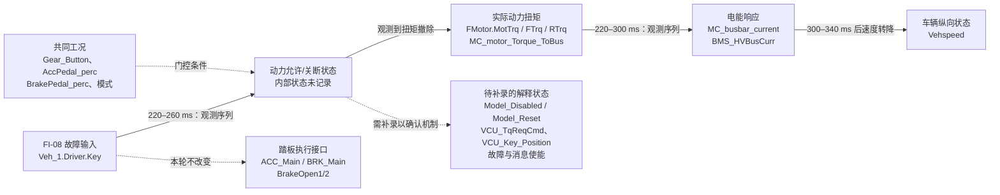

# FI-08 钥匙（Key）故障：故障传播图（20 ms）

## 结论

录波配置确认本次 FI-08 注入接口是 `Veh_1.Driver.Key`，因此本报告按钥匙故障处理。数据包含 24 个信号、4583 个样本，采样周期约 20 ms。

运行中 Key 下降沿后，MC 扭矩、前后实际扭矩和 MC 母线电流在约 220–260 ms 内降至下降沿前基线的 5% 以下，BMS 母线电流在约 260–300 ms 内下降；车速约 300–340 ms 达到惯性峰值后转为下降。Key 恢复为 1 并不会自动恢复动力。该行为表明 Key 影响的是动力允许/扭矩链，而不是通过改变踏板模拟量输出来实现关断。

`动力允许/关断状态` 是解释节点，不是已记录的内部变量。当前数据只能确认 Key 边沿与动力撤除之间稳定的时间序列，不能判断是 Key 状态机锁存、上层 VCU 清除了扭矩请求，还是两者共同造成。

## 三类故障的传播证据

| 故障 | Key 波形与工况 | 扭矩/MC 电流降至基线 5% | BMS 电流降至基线 5% | 车辆响应 | 安全判读 |
| --- | --- | ---: | ---: | --- | --- |
| 突然熄火 | `1→0`，`Gear=1`、`Acc=100%`、`Brake=0%` | 260 ms | 300 ms | 车速 `161.29`，340 ms 达 `162.56` 后下降 | 观察到驱动切断。 |
| 失灵脉冲 | `1→0→1`，低电平 620 ms；其余驾驶工况不变 | 220 ms | 260 ms | 300 ms 后转为滑行 | Key 恢复后至少 5.12 s 未自动恢复驱动。 |
| 错误唤醒 | `0→1→0`，高电平 600 ms；`Gear=0`、`Acc=0%`、`Brake=100%` | 不适用，始终为 0 | 不适用，始终为 0 | `-0.392～0.392`，静止附近波动 | 未观察到意外驱动。 |

失灵脉冲恢复后的 5.12 s 内，MC/前后实际扭矩全程为 `0`；MC/BMS 电流仅为约 `1.7–2.8` / `3.2–5.1` 的近零量级。该结果防止了脉冲恢复后的非预期再驱动，但是否满足产品的“自动恢复”需求需由需求规范决定。

## 踏板执行通道的排除证据

在运行中两次 Key 关断时，加速踏板和制动踏板的值及对应 ACC/BRK 模拟量输出仍由各自踏板保持决定；Key 下降沿没有把它们强制改写为零。错误唤醒工况中，`BRK_Main=4 V`、`ACC_Main=1 V`、`BrakeOpen1=2` 均保持不变，且动力扭矩始终为零。

因此，本轮不能把动力切断归因于制动执行输出变化；更符合证据的解释是 Key 在动力允许或扭矩链路中起作用。

## 因果边界

- 可确认：Key 下降沿后扭矩、电流和车速响应的时间序列；Key 脉冲恢复与“无自动再驱动”；静止制动工况下错误唤醒不产生动力输出。
- 不可确认：Key 关断锁存、VCU 扭矩请求清零、模型禁用/复位与诊断状态之间的内部因果关系。
- 未记录：`Model_Disabled`、`Model_Reset`、`VCU_TqReqCmd`、`VCU_Target_output_Torque`、VCU 钥匙状态、接触器/动力允许状态和故障诊断位。
