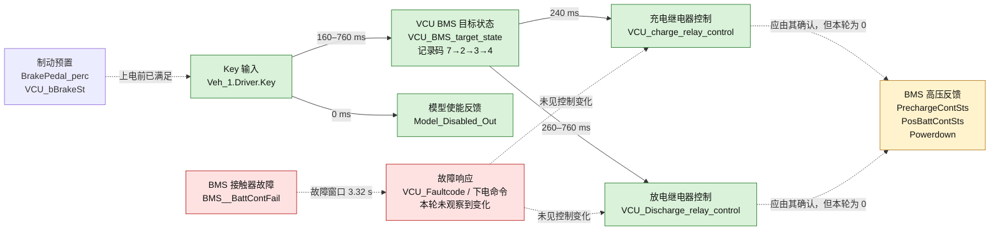

# TS-08 上下电基准：状态与故障传播图（20 ms）

> 编号校正：本图对应**实验 8（上下电基准）**；图中分析的原始录波仍使用设备端文件名 `TS-06-上下电基准_0.mdf`。

绿色链路是本轮已记录到的命令/状态变化。黄色节点代表关键 BMS 执行反馈未变化，不能证明高压闭合或下电真正完成。红色链路表示故障置位后没有观察到预期的下电或故障码响应；这是一项待复核发现，而非模型已满足故障保护的结论。

## 关键因果边界

- `Key → Model_Disabled_Out` 仅证明两者在记录中同步，不能确定数值 1/2 分别表示“禁用”或“使能”。
- `Key → VCU_BMS_target_state → 继电器控制` 有稳定的时序关系；但不排除测试程序同时安排这些命令，内部状态机因果仍需 VCU 源模型/日志确认。
- BMS 反馈恒为 0 时，不能把继电器“控制命令”当成接触器“实际闭合”。
- `BMS__BattContFail` 的来源、有效码值及故障等级需由 DBC/枚举定义确认；若 1 为有效故障码，本轮未观察到紧急下电是必须复测的风险点。
