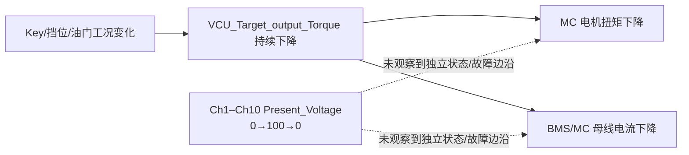

# TS-12 电压通道 Ch1–Ch10：响应分析（20 ms）

## 结论

本轮已验证 `Veh_1.FromVCU.HW.Voltage Input.Y_Ch1_Present_Voltage` 至 `Y_Ch10_Present_Voltage` 的写入和录波路径：每个通道均从 `0` 置为 `100` 后恢复为 `0`，单次保持约 200–220 ms。

在**已记录的响应接口**中，未发现能够归因于任一 ChN 的离散状态、故障等级或固定能量策略变化。因此，Ch1–Ch10 到整车功能输出的映射仍为**未解析**。母线电流、电机扭矩等连续量确实发生了变化，但变化与 `VCU_Target_output_Torque` 的下降严格同向，不能作为电压通道响应的证据。

## 数据与限制

| 项目 | 结果 |
| --- | --- |
| 原始数据 | `TS-12-电压通道_1.mdf` / `TS-12-电压通道_639226681368096398_1.tmp` |
| 样本数 / 时长 | 344 / 约 6.86 s |
| 采样周期 | 约 20 ms |
| 注入信号 | Ch1–Ch10 的 `Present_Voltage`；值均为 `0→100→0` |
| 未记录的配对量 | `Y_Ch1_Average_Voltage` 至 `Y_Ch10_Average_Voltage` |
| 关键混杂工况 | 注入前已发生 Key 上电、挂挡、制动释放和油门置 100%；注入过程中 VCU 扭矩请求持续下降。 |

`Present_Voltage=100` 的工程单位、允许范围和各 ChN 的物理功能尚未由标定/DBC 确认。因此，`100` 在此只记作试验写入值，不能直接解释为 100 V。

## 通道级结果

下表以通道置位时刻到恢复时刻的首末采样点比较。`BMS_HVBusCurr`、`MC_motor_Torque` 的变化与同一窗口中的 VCU 扭矩请求变化一致；“未确认”不表示通道无连接，仅表示本轮信号集和工况不足以证明因果关系。

| 通道 | 注入窗口 | VCU 目标扭矩 | MC 电机扭矩 | BMS 母线电流 | 因果判定 |
| --- | --- | ---: | ---: | ---: | --- |
| Ch1 | 1.34–1.54 s | 288 → 212 | 285.36 → 209.11 | 1575.99 → 1378.01 | 连续量下降由扭矩请求下降解释；未确认 Ch1 响应。 |
| Ch2 | 1.76–1.98 s | 165 → 146 | 163.53 → 145.65 | 1190.11 → 1099.35 | 同上。 |
| Ch3 | 2.20–2.42 s | 134.5 → 127 | 134.32 → 126.56 | 1038.38 → 1010.59 | 同上。 |
| Ch4 | 2.64–2.84 s | 121.5 → 118 | 121.23 → 117.83 | 980.90 → 965.10 | 同上。 |
| Ch5 | 3.06–3.28 s | 115.5 → 113.5 | 115.21 → 113.39 | 956.42 → 952.84 | 同上。 |
| Ch6 | 3.50–3.72 s | 112 → 111.5 | 112.13 → 111.26 | 950.57 → 948.82 | 同上。 |
| Ch7 | 3.94–4.14 s | 110.5 → 110.5 | 110.66 → 110.27 | 948.05 → 947.76 | 扭矩请求已基本稳定，输出仅有平滑小幅漂移；未见状态或故障响应。 |
| Ch8 | 4.36–4.58 s | 110 → 110 | 110.02 → 109.79 | 948.18 → 948.29 | 未见可归因变化。 |
| Ch9 | 4.80–5.02 s | 109.5 → 109.5 | 109.64 → 109.50 | 949.00 → 949.37 | 未见可归因变化。 |
| Ch10 | 5.24–5.46 s | 109.5 → 109.5 | 109.45 → 109.40 | 950.53 → 951.32 | 未见可归因变化。 |

完整数值见：[TS-12_通道响应对比.csv](TS-12_通道响应对比.csv)。

## 未观察到的离散响应

| 记录接口 | 结果 | 含义 |
| --- | --- | --- |
| `Veh_1.ToVCU.powerCAN_out.SoftMCUDataToBus.MC_General.MC_system_Fault_level_ToBus` | 全程 0 | 未见 MCU 故障等级变化。 |
| `Veh_1.ToVCU.powerCAN_out.SoftBMSDataToBus.BMS_General.BMS_mode_ToBus` | 全程 0 | 未见 BMS 模式切换。 |
| `...BMS_max_charge_voltage_ToBus` / `...BMS_max_discharge_voltage_ToBus` | 全程 0 | 未见已记录的 BMS 电压能力值变化。 |
| `...MC_busbar_Voltage_ToBus` | 上电后保持约 397.824 | 在 Ch1–Ch10 各窗口内没有通道同步的阶跃。 |

本轮未记录 BMS 欠压/过压/采样故障位、BMS 接触器反馈、DC/DC 输入输出、继电器状态和各 ChN 的 `Average_Voltage`；因此不能对这些支路作“无响应”结论。

## 因果关系判断

图中的实线为本轮时序支持的关系；虚线表示本轮未能验证的 ChN 传播路径，而不是“通道必然无效”。

## 下一轮建议

1. 将 Key、挡位、油门和 `VCU_Target_output_Torque` 固定在稳态；不要在通道扫描期间改变驾驶员工况。
2. 每通道至少保持 2–3 s，注入前后各记录 3 s；本轮约 0.2 s 的保持时间过短。
3. 同时记录同一通道的 `Present_Voltage` 与 `Average_Voltage`，并分别做同步欠压、仅 Present 偏置、仅 Average 偏置和冻结。
4. 增录 BMS 欠压/过压/采样错误位、BMS 模式/接触器反馈、DC/DC 电压电流、继电器输出和 VCU 故障码。
5. 对 Ch7–Ch10 等扭矩请求已稳定的窗口优先复验；它们最适合作为去除动力工况混杂后的通道探测起点。
